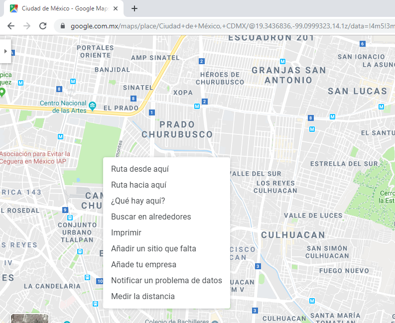

# Cómo calcular la longitud de sombras para un sistema de páneles solares

- [Cómo calcular la longitud de sombras para un sistema de páneles solares](#c%c3%b3mo-calcular-la-longitud-de-sombras-para-un-sistema-de-p%c3%a1neles-solares)
  - [Conocer la ubicación exacta de un lugar](#conocer-la-ubicaci%c3%b3n-exacta-de-un-lugar)
  - [Conocer la posición del sol](#conocer-la-posici%c3%b3n-del-sol)
  - [Calculo de longitud de la sombra](#calculo-de-longitud-de-la-sombra)
    - [Distancia entre filas de páneles](#distancia-entre-filas-de-p%c3%a1neles)
    - [Distancia entre páneles y objetos](#distancia-entre-p%c3%a1neles-y-objetos)

**La sombra es el peor enemigo de los páneles solares**. Si la sombra llega aunque sea a cubrir la parte de abajo de un pánel, es suficiente para que el valor de voltaje y amperaje sean _cero_.

Se debe de terner demasiado cuidado en donde se ponen los páneles. Si van a colocarse en el suelo, debe ser completamente a campo abierto, alejado de árboles o casa, incluso de toda hierba de tamaño considerable; y si se van a colacor en un techo, se debe aislar de objetos como los tinacos o cosas que causen sombra o colocarlos de manera estratégico.

## Conocer la ubicación exacta de un lugar

La ubicación de un lugar se conocerá por dos valores,  la Latitid y la Longitud. Para conocer dichos valores, se debe ir a una página donde se tenga el mapa disponible; lo más común [GoogleMaps](https://www.google.com.mx/maps/ "Google Maps") o [GoogleEarth](https://www.google.com/intl/es/earth/ "Google Earth")

Primero dando un ejemplo con Google Earth; entramos a la página y se busca el lugar donde se desea poner el sistema de páneles y damos un clic en la ubicación y en la parte de arriba apareceran dos números que serán la Latitud y la Longitud.

La otra forma y la más usada es en Google Maps.

Primero nos vamos a la página, y buscamos el lugar donde se piensa poner los páneles solares; ubicado el lugar, damos clic derecho en el mapa y nos aparecerá las siguientes opciones.

Seleccionamos la opción que dice _"¿Qué hay aquí?"_ y nos aparecerá un pequeño cuadro de diálogo que nos mostrará la Latitud y la Longitud; además al igual que en Google Earth aparecera en la parte de arriba donde esta la URL.

## Conocer la posición del sol

Con las posiciones del sol, podremos conocer los ángulos de elevaciones y saber cuanta sombra refleja cada objeto; y así se sabrá las distancias adecuadas entre cada fila de páneles o qué tan alejado debería estar de todos los objetos que le puedan provocar sombra.

La página que se usará es la de [SunEarthTools](https://www.sunearthtools.com "Sun Earth Tools") y aparecerá una ventana como esta:

Lo siguiente que se hará es ir a las opciones del cuadro que aparece de lado izquierdo, y se selecciona donde dice "Posición del sol" y se mostrará algo como lo siguiente:

Estando en esta página, pondremos en donde dice "Buscar" los datos encontrados anteriormente de la Latitud y la Longitud, y damos un enter.

Además en la misma página se puede buscar la ubicación del lugar deseado, solo que es un poco más complicado. Lo dejo a tu desición de cómo te acomodes mejor.

Ahora, debemos conocer cuál es el día de año cuando se tiene la longitud de sombra más grande de un objeto. Por lo regular, **los peores días son los 21 de diciembre**; y exactamente ese día es el que se le va a agregar y además le pondré a las 12 de la tarde. Finalmente le damos en ejecutar.

Ya que se ha realizado la ejecución, bajamos y veremos algunas imagenes que nos muestra la trayectoria del sol durante todo el año; la línea de color amarilla, es el día que se esta buscando. Y además desde la gráfica se puede hacer la intersección entre la hora y el ángulo de inclinación.

Por último se observará una tabla de las elevaciones del sol con respecto a las horas del día.

## Calculo de longitud de la sombra

Casi en la parte final de la página que se ha mencionado anteriormente, se encontrará una especie de calculadora de longitud de sombras donde puedes agregar la elevación del sol y la altura del objeto.

En este repositorio, encontraras un [archivo excel](./longitud-de-sombra.xlsx "Libro excel para calcular la longitud de sombras") donde de manera muy fácil encontrarás la longitud de la sombra. En este archivo estan incluidas unas imágenes para que te sirvan como guías.

### Distancia entre filas de páneles

Primero se va a calcular la sombra que los páneles provocan, y a que distancia debería estar fila tras fila

* **Paso 1**: de la tabla que se muestra anteriormente, vamos a tomar el ángulo de elevación del sol más pequeño, de las horas que más importa de aprovechamiento para un panel. Suponiendo que las horas de más importancia es de las 11 de la mañana hasta aproximadamente a las 5 de la tarde, escogemos el ángulo correspondiente. En este caso se tomará el ángulo de 22.4°.

* **Paso 2**: el siguiente dato, es la longitu del pánel o páneles que se colocarán. Escogeré que son dos páneles de una longitud cada uno de 2 metros; por lo tanto tendría una longitud de 4 metros.

* **Paso 3**: por último, debemos conocer el ángulo que va a tener la estructura de los páneles. Si ya has trabajado en esto, debes saber que, **el ángulo de la estructura debe ser igual a la Latitud**. En este caso como la latitud es 19.3499, se usará un valor estandar de 20°.

Teniendo los datos anteriores, se agrega a la tabla de excel, y este arrojará los datos calculados.

### Distancia entre páneles y objetos

Ahora, si queremos conocer a qué distancia deben estar los páneles de los objetos, lo calculamos un poco diferente. Esa parte, aparecerá en el mismo archivo, pero más abajo.

Lo único que debemos poner es la altura del objeto, y listo.

